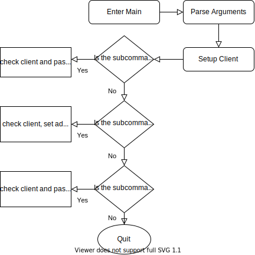

.. _main_module:

##########
Main Class
##########

The main class is the entrypoint into the code when running it from the commandline, it is responsible for parsing and handling the commandline arguments before handing control to one of the modules.

The main class only has two variables, a static String version variable and a variable that stores a reference to the script controller. The version variable should match the version in the pom.xml in the root of the project and the release variable in the conf.py file in the folder sphinx-docs/source.

FlowChart
---------

The flow of the main class is fairly simple, parse and check arguments, handle setting up the client as it is used by all the submodules and then check which module is set before handing control over to the specific module. If no subcommand is specified then the program just quits, a subcommand may not be set if the user is just checking the version or the help page.

Parse Arguments
---------------

The block of code is used to build the argparse4j object, and configure the various arguments. Subparsers are used to parse the arguments for each of the submodules with their own arguments. 

.. code-block:: java 
    :lineno-start: 53

    ArgumentParser parser = ArgumentParsers.newFor("eloki2").build()
            .description("A tool to generate, record and replay browser sessions");
    parser.addArgument("--client")
        .choices(new IgnoreChoice("SeleniumChrome","SeleniumFirefox"))
        .dest("client")
        .help("sets the browser client to use");
    parser.addArgument("--driver").dest("driver").help("Sets the driver used by selenium");
    parser.addArgument("--full-browser")
        .dest("fullBrowser")
        .help("Use the full browser instead of a headless browser(if possible)")
        .action(Arguments.storeFalse());
    parser.addArgument("--headless")
        .dest("headless")
        .help("Hide the browser from view with Selenium Clients")
        .action(Arguments.storeTrue());
    parser.addArgument("--proxy")
        .dest("proxy")
        .metavar("address:port")
        .help("Set the [address:port] of the SOCKS5 proxy to use");
    parser.addArgument("--useragent")
        .dest("useragent")
        .help("Sets the user agent for the browser");
    parser.version(version);
    parser.addArgument("--version").action(Arguments.version());

The first few lines sets up the global flags and some details for the help message. 

.. code-block:: java 
    :lineno-start: 78

    //Run sub-module, used to run scripts
    Subparsers subparsers = parser.addSubparsers().help("sub-command help");
    Subparser runscript = subparsers.addParser("run")
            .help("Run a script")
            .setDefault("runscript", true);
    runscript.addArgument("--randomMove")
        .help("Randomize movement of mouse slightly")
        .action(Arguments.storeTrue())
        .dest("randomize");
    runscript.addArgument("--batchMove")
        .help("Batches various movement actions into a single one")
        .action(Arguments.storeTrue())
        .dest("batchMove");
    runscript.addArgument("--naturalMove")
        .help("Simulates natural mouse movement")
        .dest("naturalMove");
    runscript.addArgument("script")
        .nargs("+")
        .help("Script to run");

The above block sets up the subparser for running the recorded scripts. The various flags are used to activate different features when running the script. 

.. code-block:: java 
    :lineno-start: 99

    //Scraper sub-module, used to scrape websites
    Subparser scraper = subparsers.addParser("scrape")
            .help("Scrape a website using Selenium")
            .setDefault("scrape", true);
    scraper.addArgument("url")
        .required(true)
        .help("url to scrape");
    scraper.addArgument("--max-depth")
        .setDefault(10)
        .metavar("DEPTH")
        .type(Integer.class)
        .help("Maximum depth from first url to scrape, 0 means scrape only the given url");
    scraper.addArgument("--timeout")
        .metavar("MILLIS")
        .setDefault(1000)
        .type(Integer.class)
        .help("The time to wait between get requests, in milliseconds");
    scraper.addArgument("--dest")
        .metavar("FILE")
        .setDefault("anchors")
        .help("File to save the scraped urls to.");
    scraper.addArgument("--add-prefix")
        .metavar("URLs")
        .dest("prefixes")
        .nargs("+")
        .help("Additional URL prefixes to scrape");

This block sets up the subparser for the scraper and the various flags the controls its behavior. See :ref:`the scraper documentation <usage/scraper>` for details on these flags. 
 

.. code-block:: java 
    :lineno-start: 126

    //Sub-module for used to capture recordings
    Subparser capture = subparsers.addParser("capture")
            .help("Record a session using Selenium")
            .setDefault("capture", true);
    capture.addArgument("--passive")
        .dest("passive")
        .action(Arguments.storeTrue())
        .help("Use the passive session capture method, if iframe embedding is blocked by the site");

Finally this block sets up the flags for the capture module. 

There is a small portion of the code afterwards starting on line 136 the various script actions are inserted into the main parser. As it currently works, the various actions the script recognizes is set manually in this section with the string key being the action in the script file i.e. mouseMoveScroll or waiting and tied to a particular class that handles the action. Any new actions added will also needed to be added here to be recoginzed by the parser. This design also makes it possible to swap various actions with different classes to handle them depending on desired behavior.

Setup Client
------------

.. code-block:: java
    :lineno-start: 163

    boolean headless = false;
    if(res.getBoolean("headless")!=null) {
        headless = res.getBoolean("headless");
    }
    
    //resolve the client
    String clientName = res.getString("client");
    Client client = null;
    if(clientName!=null) {
        if(clientName.equalsIgnoreCase("SeleniumChrome")) {
            if(res.getString("driver")==null) {
                System.err.println("The ChromeDriver must be set using the --driver argument");
                System.exit(1);
            }
            System.setProperty("webdriver.chrome.driver", res.getString("driver"));
            client = new SeleniumChrome();

        }
        else if(clientName.equalsIgnoreCase("SeleniumFirefox")) {
            if(res.getString("driver")==null) {
                System.err.println("The GeckoDriver must be set using the --driver argument");
                System.exit(1);
            }
            System.setProperty("webdriver.gecko.driver", res.getString("driver"));
            client = new SeleniumFirefox();
        }
    }
    
    //set stuff specific to Selenium instances
    if(client instanceof SeleniumClient) {
        SeleniumClient sClient = (SeleniumClient) client;
        //Set the proxy, SOCKS v5. Can be used to tunnel through tor
        if(res.getString("proxy")!=null) {
            Proxy proxy = new Proxy();
            proxy.setSocksVersion(5);
            proxy.setSocksProxy(res.getString("proxy"));
            sClient.setProxy(proxy);
        }
        if(res.getString("useragent")!=null) {
            sClient.setUserAgent(res.getString("useragent"));
        }
    }
    
This block of code handles the various arguments related to the client and sets up the client object. Lines 163-166 handles the headless argument, it does not immediately set the client to use headless as the capture module always runs a full browser. Lines 169-189 handles initiating the client itself setting the driver and starting the client. Lines 192-204 handles setting the proxy which is the same for both browsers, the browser clients wrap a method of setting the proxy that works. 

Setup RunScript module
----------------------

.. code-block:: java
    :lineno-start: 206

    //Section of the code that handles the run sub-module
    if(res.getBoolean("runscript")!=null) {
        //Various checks related to the client
        if(client==null) {
            //TODO change to more generic message
            System.err.println("The selenium client and driver must be set using --client and --driver");
            System.exit(1);
        }
        if(client instanceof SeleniumClient) {
            ((SeleniumClient) client).setHeadless(headless);
        }
        //Init client and iterate through the list of given scripts and execute them one after another
        client.init();
        for(Object s:res.getList("script")) {
            try {
                ActionImpl initial = defaultController.parseScript(Files.readAllLines(new File(s.toString()).toPath()));
                Script script = new Script(initial);
                
                if(res.getBoolean("randomize")) {
                    script = new SimpleRandomMove().modify(script);
                }
                //BatchMove will consume the movement actions in the click and drag
                script = new CreateClickAndDrag().modify(script);
                if(res.getBoolean("batchMove")) {
                    script = new CreateBatchMoves().modify(script);
                }
                else if(res.getString("naturalMove")!=null) {
                    if(res.getString("naturalMove").equalsIgnoreCase("granny")) {
                        script = new CreateNaturalMoves(FactoryTemplates.createGrannyMotionFactory()).modify(script);
                    }
                    else if(res.getString("naturalMove").equalsIgnoreCase("gamer")) {
                        script = new CreateNaturalMoves(FactoryTemplates.createFastGamerMotionFactory()).modify(script);
                    }
                    else if(res.getString("naturalMove").equalsIgnoreCase("average")) {
                        script = new CreateNaturalMoves(FactoryTemplates.createAverageComputerUserMotionFactory()).modify(script);
                    }
                    else {
                        script = new CreateNaturalMoves().modify(script);
                    }
                }
                defaultController.runScript(script, client);
            } catch (IOException e) {
                System.err.println("Error reading script "+s);
                System.err.println(e.getMessage());
            }
        }
        //Close the client
        if(client instanceof Closeable) {
            ((Closeable)client).close();
        }
    }

Lines 208-218 handles checking the client and initializing it. Line 219 is the main for loop that goes through each of the scripts in the arguments and executes them. Each execution is surounded in a try catch block to recover from errors in any one script. Lines 221 and 222 loads the script from file and does the initial parsing. Lines 224-245 modify the script according to the flags set and line 246 executes the script. Finally lines 253 to 255 closes the client. 

Setup Scraping Module
---------------------

.. code-block:: java
    :lineno-start: 259

    else if(res.getBoolean("scrape")!=null) {
        //Various checks related to the client
        if(client==null) {
            System.err.println("The selenium client and driver must be set using --client and --driver");
            System.exit(1);
        }
        if(!(client instanceof SeleniumClient)) {
            System.err.println("The client must be a Selenium Client, either Selenium-Firefox or Selenium-Chrome");
            System.exit(1);
        }
        else {
            //Initialize the client
            SeleniumClient sClient = (SeleniumClient)client;
            headless = res.getBoolean("fullBrowser");
            sClient.setHeadless(headless);
            sClient.init();
            
            //Initialize the scraper
            SeleniumScraper selScraper = new SeleniumScraper((SeleniumClient)client);
            //Dest is the destination file to write to
            selScraper.setDest(res.getString("dest"));
            //Prefixes are the list of url prefixes that the scraper will look for in addition to the baseurl
            if(res.get("prefixes")!=null) {
                selScraper.setPrefixes(res.getList("prefixes").stream().map(Object::toString).collect(Collectors.toList()).toArray(new String[] {}));
            }
            //max-depth is the maximum depth of links to follow, depth of a link is minimum # of clicks
            //needed to get to that link from the initial page
            selScraper.setMaxDepth(res.getInt("max_depth"));
            
            //Start the scaper
            selScraper.scrapeSite(res.getString("url"));
        }

    }

The setup for the scraping module is similar to the runscript module checking the client in lines 261-268 and then extracting and setting the various variables used by the scraping module before starting it.

Setup Capture Module
--------------------

.. code-block:: java
    :lineno-start: 295

    else if(res.getBoolean("capture")!=null) {
        //Usual client checks
        if(client==null) {
            System.err.println("The selenium client and driver must be set using --client and --driver");
            System.exit(1);
        }
        if(!(client instanceof SeleniumClient)) {
            System.err.println("The client must be a Selenium Client, either Selenium-Firefox or Selenium-Chrome");
            System.exit(1);
        }
        ExtensionLoader.loadExtension(client, ExtensionsList.IgnoreXFrame);
        client.init();
        //Select capture method based on the --passive arg
        if(res.getBoolean("passive")) {
            MouseCapture.captureRecording2((SeleniumClient)client);
        }
        else {
            MouseCapture.captureRecording((SeleniumClient)client);
        }

    }

The setup for the capture module is again fairly similar checking the client in lines 297-304 before initializing the client and selecting the entrypoint into the capture module based on whether the passive flag is set.

.. note::

    The explicit client checks are currently done in every module as there may be modules in the future that are added that do not need to have a client setup i.e. a configuration module.