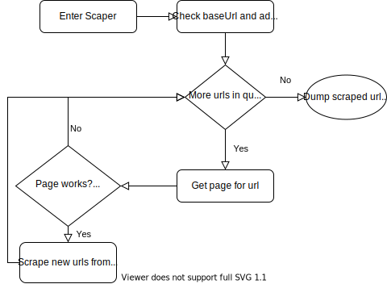

###############
Scraping Module
###############

The scraper module currently split into three classes. The SeleniumScraper.java class controls most of the core logic for the scraper and is the main entrypoint into the scraper module. This section will mostly cover this class and how it works. 

The ScraperSession.java class is responsible for storing most of the important variables related to scrapign and persisting it in an sqlite database. This allows the scraper to be stopped and resumed fairly easily taking advantage of the ACID guarantees to ensure that the data remains in a consistent state. The separation could also allow additional scrapers using different libraries or methods. Most of the class functions deal simply wrap queries to the database that extracts or sets variables as needed. An explanation on the tables will be given at the end of this page.

The QueueURL.java class is just a container class that stores a particular url and its depth, it may be extended in the future to hold additional data relevant to more functionality.

FlowChart
---------

The flow of the scraping module is centered around the core loop where it polls the queue for a new url and then proceeds to check and extract urls from the page. The main exit from the loop is when the queue is empty and all urls have been scraped. When the program is forcibaly terminated i.e. CTRL-C, that data related to the current progress in scraping a site is persisted in a database called ``inprogressScrape.db`` which is updated every time a the scraper finishes with a particular page. When restarting the scraper, if the url is the same it will initialize some variables from the database in the ``check url and add to queue phase`` and resume progress from where it left off. Sqlite was chosen in particular as it was an embedded database with strong ACID guarantees to ensure that the data will remain consistent no matter what happens and it is also fairly easy to look through the data with its commandline interface.

Check baseUrl and add to Queue
------------------------------

.. code-block:: java
    :lineno-start: 113

    if(session==null) {
        session = new ScraperSession();
    }
    
    baseUrl = urlStr;
    
    //Some checks to make sure that the given string is a proper url
    //also some stuff to make sure the query portion is url encoded
    try{
        URL url = new URL(baseUrl);
        URI uri = new URI(url.getProtocol(), url.getUserInfo(), IDN.toASCII(url.getHost()), url.getPort(), url.getPath(), url.getQuery(), url.getRef());
        baseUrl = uri.toASCIIString();
    }catch(MalformedURLException | URISyntaxException e){
        try{
            //assume most sites will auto upgrade an http connection to https
            URL url = new URL("http://"+baseUrl);
            URI uri = new URI(url.getProtocol(), url.getUserInfo(), IDN.toASCII(url.getHost()), url.getPort(), url.getPath(), url.getQuery(), url.getRef());
            baseUrl = uri.toASCIIString();
        }catch(MalformedURLException | URISyntaxException e1){
            System.err.println(e1.getMessage());
            //TODO better error handling
            System.exit(1);
        }
    }
    if(session.getBaseUrl().equals("")) {
        //Start with the base url
        session.offerUrl(new QueueURL(baseUrl,0));
    }
    //Get the actual url of the page, after any redirects etc
    baseUrl = validateURL(baseUrl);
    //Gets the base folder path of the url, the scraper will only look for links under that pattern
    int endSlash = baseUrl.lastIndexOf('/');
    if(endSlash>7){
        baseUrl = baseUrl.substring(0, endSlash);
    }
    System.out.println("Scraping with base prefix="+baseUrl);
    //check if theres an existing session
    if(!session.getBaseUrl().equals("")) {
        //If the database contains the scraping session for another site abort as it is not what the user likely wants
        if(!session.getBaseUrl().equals(baseUrl)) {
            System.err.println("The baseUrl for the existing scraping session does not match the supplied url, aborting");
            System.err.println("Delete or rename the inprogressScrape.db file to remove the previous session");
            return;
        }
        System.out.println("Found existing scraping session, adding existing prefix filters");
        //effectively union the two sets of prefixes, the ones that already exist in the database
        //with w/e new ones were supplied
        session.addPrefixes(prefixes);
        setPrefixes(session.getPrefixes());
    }
    else {
        session.setBaseUrl(baseUrl);
    }
    //Commit once all the inital data has been written
    session.commit();

This portion of the code deals with most of the intialization of state and checking the baseUrl given. 

Line 114 initializes the scraper session object which by default uses the database name ``inprogressScrape.db``, if it already exists and it is resuming a session then there is a check on line 150 to determine this which gets the baseUrl value in the database, if it is the empty string then it is a newly initiated database otherwise it already has data from a previous interrupted scrape. Additionally on lines 137 to 140 the same check is done so that the baseUrl isn't added to the queue again. Lines 152-156 checks if the url stored in the database is the same as the url passed through for this session. If they differ then it means that the user is not trying to scrape the same website and may not realize that there is an interrupted scraping session. The program then prints some messages informing the user before quitting. Otherwise it loads the only piece of data that is kept in the SeleniumScraper class, the prefixes it checks to avoid extending to too many domains.

Lines 121-136 is the first check done to make sure the base url is valid. It tries first with the raw baseUrl and then again with the http:// protocol if something like ``www.yorku.ca`` is given instead of ``http://www.yorku.ca``. The check is done by attempting to construct a URL object with the baseUrl, if it fails then it is an invalid url from a syntax standpoint. The conversion to an URI object before converting it back to a string is to help normalize the urls by url-encoding any invalid characters. There have been cases in testing where a url can contain some characters that should be url-encoded. Line 142 calls the  validateURL function which requests the page and then fethes the url in the url bar using Selnium, this is done to further normalize the url going through redirects and ensuring the protocol is correct (http should be auto-upgraded to https if available). Lines 144-147 then strips the url of the file, query and ref portions so something like https://www.rbc.com/about-rbc.html is stripped to https://www.rbc.com. This is then what is used as a prefix filter to ensure all scraped urls stay on the same site. Additional filters can be added with the ``--add-prefix`` argument. Additionally this is the url stored in the database as the original is no longer relevant for continuing the scrape the site.

Line 167 commits everything once the initial state of the database has been setup. Further commits are done each time the scraper finishes scraping a page just before the timeout it waits between requests to pages.

Queue Check
-----------

The queue check is simply the following:

.. code-block:: java

    (u=session.getNextUrl())!=null

and session.getNextUrl() is just a query to the queue table in the database and a delete for the entry retrieved.

.. code-block:: java
    :lineno-start: 367

    try(ResultSet rs = dbConnection.createStatement().executeQuery("SELECT * FROM QUEUE")){
        if(rs.next()) {
            QueueURL url = new QueueURL(rs.getString("URL"),rs.getInt("DEPTH"));
            PreparedStatement delUrl = dbConnection.prepareStatement("DELETE FROM QUEUE WHERE URL = ?");
            delUrl.setString(1,url.url);
            delUrl.execute();
            return url;
        }
    }catch(Exception e) {}
    return null;
    
The database should never enter an inconsistent state where a url has been retrieved from the queue but not deleted or the opposite as autocommit is turned off. Commits are done at specific points in the SeleniumScraper class to ensure consistency.

Get Page
--------

The code to get a page is as follows:

.. code-block:: java
    :lineno-start: 228

    client.getWebDriver().get(url.url);
    try {
        //another sleep to try and wait through strange redirects not done using code 302 re:rbc.com
        Thread.sleep(1000);
    } catch (InterruptedException e1) {}
    //Wait for the page to fully load
    client.awaitPageLoad(10000);

It is fairly simple, and includes a sleep before checking if document.readyState==complete to give some time for the browser to follwo redirects. 

.. note::

    There is currently an issue where the program does not check if the url is an actual html page as opposed to some resource, if the url is something that automatically download then it may clutter the folder in which you run the program. There does not appear to be an easy solution to check this in selenium and it may be necessary to use something like JSoup or a raw http request to check the mime type of the page although this may bring up issues where some pages aren't scraped as these initial checking requests may be filtered out by bot detection protocols.

Page Checks
-----------

The next bit of code does some checks with the page itself:

.. code-block:: java
    :lineno-start: 235

    //Get the actual url w/o the reference or query portions
    String finalURL = printURL(new URL(client.getWebDriver().getCurrentUrl()));
    //skip page if it is not valid
    if(!checkURL(finalURL)) return;
    //skip page if was already visited/checked
    if(session.hasVisited(finalURL)) return;
    if(finalURL.equals(baseUrl)){
        finalURL = finalURL+"/";
    }
    System.out.println(finalURL+" "+session.getQueueSize()+" left");
    //Add to the visited set which tracks all the urls found by the scraper
    session.addVisited(new QueueURL(finalURL, url.depth));
    //skip scraping for more urls if it's at the max depth
    if(url.depth>=maxDepth) return;

The finalURL variable on line 236 is the url in the url bar to help normalize the urls and to avoid visiting the same page twice. The printURL function is a part of this and is a copy of the code from URL.toString with the portions for printing the query and reference portion of the url stripped.

The checkURL function on line 238 goes through the various prefix filters that may have been added and returns false if it doesn't match any. Any future filters/checks will be added here.

Line 240 checks if the page was already visited by the scraper and skips the processing step if true. There is an implicit assumption that the page is unchanged since the scraper has first visited it. Lines 241-243 normalizes the url somewhat if it is the baseUrl. 

Line 246 adds the url to the list of visited urls and line 248 skips the processing step if it's already at the maximum depth.

Scrape New Urls
---------------

This portion of the code deals with actually scraping the urls from the page and adding it to the queue to be visited. 

.. code-block:: java
    :lineno-start: 249

    //Get the page body
    RemoteWebElement body = (RemoteWebElement)client.getJSExecutor().executeScript("return document.body; ");
    if(body==null) {
        System.err.println("Null body on page "+finalURL);
        return;
    }
    //Find all links on the page using a css selector
    for(WebElement e:body.findElementsByCssSelector("a[href]")){
        String u = e.getAttribute("href");
    //			System.out.println("u="+u);
        //quick check to try and resolve relative paths
        try {
            new URL(u);
        }catch(MalformedURLException e1) {
            try {
                u = new URL(finalURL+"/"+u).toString();
            }catch(MalformedURLException e2) {
                continue;
            }
        }
        //Add the url to the queue if it was not seen before
        if(checkURL(u)&&!session.hasSeen(u)){
            session.addSeen(u);
            session.offerUrl(new QueueURL(u, url.depth+1));
        }
    }

The scraper extracts the urls using the RemoteWebElement class in Selenium, some issues with this is that if parts of the DOM changes, specifically relating to the elements inspected then it will throw and error and fail. This portion may be wrapped in a try-catch block in the future, currently most of the sites tested are fairly static and thus this issue hasn't ocurred yet. Lines 250-254 initializes this class with the body element. Line 188 finds all urls by using a css selector searching for all anchor tags with an href attribute.

Lines 192-205 contain some checks to make sure that it is a valid url. Lies 192-200 use the same trick by initializing a URL object to check that it is a full url, if it fails the initial check then the url is assumed to be relative to the current page. Lines 202-205 checks the url against the database of all urls seen by the scraper and with the prefix filters before adding it to the queue of urls to process.

.. _scrape_database_fmt :

DataBase Format
---------------

This section will cover the tables in the ``inprogressScrape.db`` database file that is used while scraping a web page. The tables have been designed with some future funtionality in mind, specifically being able to map the relation between pages such that a directed graph can be created with the information in the database. In the future the database itself, and not a list of urls would be used to generate custom sessions by creating a possible visit path that a user may take. 

.. note::

    Foreign keys haven't been added yet and are planned to make relationships clear and to ensure consistency

-----

The first table is the queue table:

.. code-block:: sql

    CREATE TABLE IF NOT EXISTS QUEUE (URL TEXT UNIQUE, DEPTH INTEGER)

All it stores is the url and the depth of the url, matching the variables in the QueueURL class. This table may be expanded to include more details in the future such as the id for the parent page.

-----

The visited table is the main table that stores the results of the scraper. Currently the final step that the scraper does is to dump all the urls from this table.

.. code-block:: sql

    CREATE TABLE IF NOT EXISTS VISITED
        ID INTEGER PRIMARY KEY AUTOINCREMENT, 
        URL TEXT NOT NULL UNIQUE,
        DEPTH INTEGER, 
        TIMESTAMP INTEGER)

The ID column is the id of the row and is used referenced by some of the other tables. The url column is the url in the url bar when visiting the page. The depth column is the minimum number of clicks from the first page it takes to get to this page. The timestamp column is included as a record of when the scraper last visited the particular page. 

-----

The next table is the Seen table

.. code-block:: sql

    CREATE TABLE IF NOT EXISTS SEEN (URL TEXT UNIQUE NOT NULL, VISITED_ID INTEGER)

This table acts as a set to check if a particular url has been seen by the scraper. The VISITED_ID column is included for future funtionality to create a directed graph by mapping the urls seen by the scraper while processing pages to the ids of the actual pages they lead to in the database. 

-----

The last table is unused currently and exists as a rough outline of some future plans to enable modeling the possible paths that can be taken while navigating a website.

.. code-block:: sql

    CREATE TABLE IF NOT EXISTS EDGES (PARENT_ID INTEGER, URL TEXT)

The edges table is used to connected the various nodes, which are the rows in the visited table, with each other in directed edges. Each row in the edge table describes a relationship wherein there is the specified url link on the page wiht the given parent_id. Parent_id is a foreign key to the id column in the visited table. Thus creating a directed edge from the parent_id to the url. The id of the url in the table can be found by referencing the seen table and the id stored there which sould be set once the page is visited and put into the visited table. 

