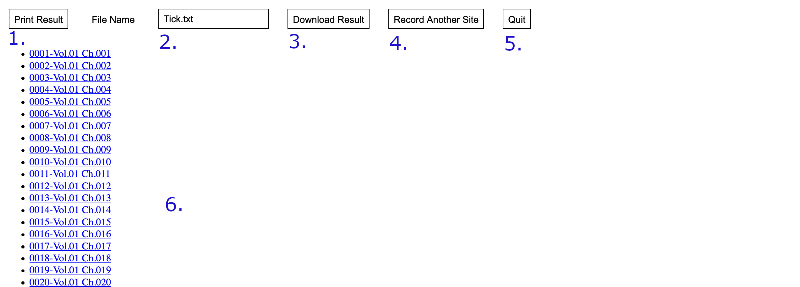
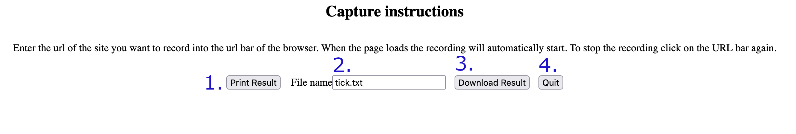

..
  Normally, there are no heading levels assigned to certain characters as the structure is
  determined from the succession of headings. However, this convention is used in Python’s
  Style Guide for documenting which you may follow:

  # with overline, for parts
  * for chapters
  = for sections
  - for subsections
  ^ for subsubsections
  " for paragraphs

#####################
Eloki2-Capture Module
#####################

The capture module is used to capture/record new sessions that can be replayed by the runscript/replay module. For information on the script format see [TODO: add script documentation]

Usage
*****

.. code-block:: console
    
    $ java -jar eLoki2.jar [--driver DRIVERFILE] [--client CLIENT] [--proxy address:port] capture [--passive]

The command opens a new Chrome/Firefox instance using Selenium that will be used to record and capture sessions. 

Options
*******

---------
--passive
---------
Use the passive recorder instead of the iframe recorder.

--------
--driver
--------
The path to the driver for Selenium, this is either the geckodriver file or the chromedriver file depending on the selenium client specified in the *--client* option.

The path must include any extensions the file may have (.exe on windows for example). Additionally for the chromedriver to work you may have to follow the additional instructions to allow it to find your chrome installation.

--------
--client
--------

The client to use, currently the only options are ``SeleniumChrome`` and ``SeleniumFirefox`` for Selenium using Chrome and Firefox respectively. Additionally the driver must be specified using the ``--driver`` option

-------
--proxy
-------

The proxy to use, by default no proxy is used. The type of proxy used is a socks5 proxy. The proxy is specified in the following format ``address:port`` where the address is either the ip address of the proxy or is domain name i.e. 127.0.0.1, localhost etc. The port is the port that the socks5 proxy is open on and must be a number from 0 to 65535. This flag can be used to connect to the tor network if the tor browser is open and connected as follows ``--proxy 127.0.0.1:9150``

Iframe Recorder
***************

When the Iframe recorder is launched you will see the Main Page shown below. 

.. image:: ../img/mainpage_annotated.png
  :width: 800
  :alt: Main page with annotations

1. URL box, enter the url of the site you want to capture a recording for. The URL must be a full URL and include the protocol such as http:// or file://. For example, ``www.yorku.ca``
2. Go Button, press to go to the webpage and launch the Iframe Recorder.

The Iframe recording page is shown below with the example site https://amazing-aryabhata-661e97.netlify.app/. To start/pause a recording, press the CTRL button. During recording the header should be red.

1. Print the results of the recording onto the screen. Disabled during recording.
2. Name to save the script as when using the Download Result Button.
3. Download the recorded script as a text file.
4. Goes back to the main page deleting anything that has not been saved or downloaded.
5. Quit the program closing the browser and deleting anything that has not been saved or downloaded. Closing the browser will also quit the program.

Passive Recorder
****************

Use for sites that block embedding with using iframes. (Note currently buggy as some sites appear to break the injected javascript)

When the passive recorder is launched you will see the following page.

1. Print the results of the recording to the screen
2. Name to save the recording script as when using the download button
3. Download the recorded script as a text file.
4. Quit the program closing the browser and deleting anything that has not been saved or downloaded. Closing the browser will also quit the program.

To start recording, visit the page of the site you want to record i.e. https://glinscott.github.io/lz/index.html. The recording will start automatically. The recording will stop once the main window loses focus, this can be done by opening a new tab, or clicking on the url bar. If this fails to redirect to the about:blank page then the injected javascript is likely broken.

