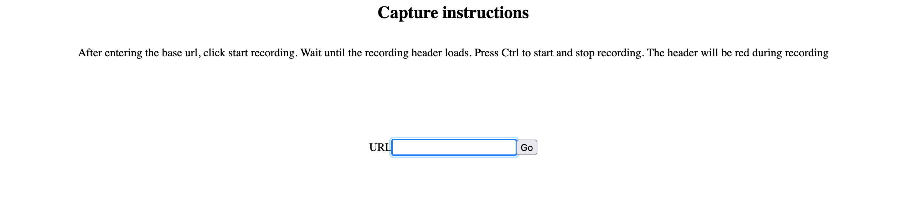
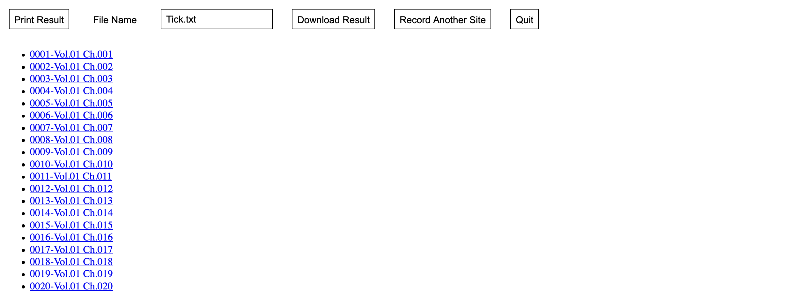

..
  Normally, there are no heading levels assigned to certain characters as the structure is
  determined from the succession of headings. However, this convention is used in Python’s
  Style Guide for documenting which you may follow:

  # with overline, for parts
  * for chapters
  = for sections
  - for subsections
  ^ for subsubsections
  " for paragraphs

##########
QuickStart
##########

This guide will go through the basics of recording and replaying a session using eLoki2 as well as installation instructions.

Installation
************

To start eLoki2 requires Java 8+ which can be downloaded from `Oracle <https://www.oracle.com/ca-en/java/technologies/javase-downloads.html>`__, `AdoptOpenJDK <https://adoptopenjdk.net/>`__, or some other vendor such as redhat etc.

Additionally you will need either Chrome and its corresponding chromedriver version or Firefox and the geckodriver. 

Firefox can be downloaded from `mozilla <https://www.mozilla.org/en-CA/firefox/new/>`__ and the geckodriver from their `github page <https://github.com/mozilla/geckodriver/releases>`__

Chrome can be downloaded from `google <https://www.google.com/intl/en_ca/chrome/>`__ and the chromedriver from the `chromnium page <https://chromedriver.chromium.org/>`__

Finally the eLoki2 jar file can be download from `here <eLoki2.jar>`__

Validating Installation
***********************

To test your java installation you can run the following command

.. code-block:: console

    $ cd eLoki2Directory/
    $ java -jar eLoki2.jar --help

``eLoki2Directory`` should be replaced with the path to the folder where the eLoki2 jar file is located.

You should see an output similar to the following

.. code-block:: console

  $ java -jar eLoki2.jar --help
  usage: eloki2 [-h] [--client {SeleniumChrome,SeleniumFirefox}] [--driver DRIVER] {run,scrape,capture} ...

  A tool to generate, record and replay browser sessions

  positional arguments:
    {run,scrape,capture}   sub-command help
      run                  Run a script
      scrape               Scrape a website using JSoup
      capture              Record a session using Selenium

  named arguments:
    -h, --help             show this help message and exit
    --client {SeleniumChrome,SeleniumFirefox}
                          sets the browser client to use
    --driver DRIVER        Sets the driver used by selenium

If you see something along the lines of ``java: command not found`` then there is likely an issue with your java installation. 

To test the chrome/geckodriver installation you can run the following command. If you are using Firefox the client should be ``--client SeleniumFirefox``, if you are using Chrome the client should be ``--client SeleniumChrome``. The path to the driver must be the full or relative path to the driver including any extensions that may be hidden by default by the file system, such as the ``.exe`` extension on windows.

For example if you are using chrome and the chromedriver file is in the current directory, on windows the command to run would be:

.. code-block:: console

    $ java -jar eLoki2.jar --client SeleniumChrome \
      --driver chromedriver.exe scrape www.yorku.ca --max-depth 0

The max-depth field is set to 0 so that only the www.yorku.ca url is retrieved, a max-depth of 1 would also retrieve all urls that can be reached from www.yorku.ca. See the ` documentation <Eloki2-Scraper Documentation.html>`__ for more details. If it has run sucessfully you there should be  a file named ``anchors`` with a single line ``https://www.yorku.ca/``. For troubleshooting some common issues see ` this <common_issues.html>`__

Recording a Session
*******************

If everythign went well while validating the installation then you can start recording a session using the following command, subsituting ``CLIENT`` and ``DRIVER`` with the client name and driver path.

.. code-block:: console

    $ java -jar eLoki2.jar --client CLIENT --driver DRIVER capture

This should open a new browser window displaying the following

Enter the full url of the site you want to capture i.e. https://www.yorku.ca, including the protocol (http:// or https://) into the URL input box and press enter.

You should see the following in header of the page once everything has loaded 

Press the CTRL key to toggle recording, while it is recording the header should be red. Record some actions such as clicking links, moving the mouse around etc. Once you're done recording press the CTRL to stop the recording and click the ``Download Result`` button to download the recording. Press the ``Quit`` button to quit the program.

Replay
******

The following command will replay the recording. Again replace CLIENT with the client name and DRIVER with the path to the gecko/chromedriver. If tick.txt is not in the same folder as where you're executing the program replace it with the full path to the file.

.. code-block:: console

    $ java -jar eLoki2.jar --client CLIENT --driver DRIVER run --script tick.txt

You should see the browser open up and replay the recorded actions. If you want to see where the mouse is at any point edit the tick.txt file to include the line ``attachMouse`` after every line with getPage.

